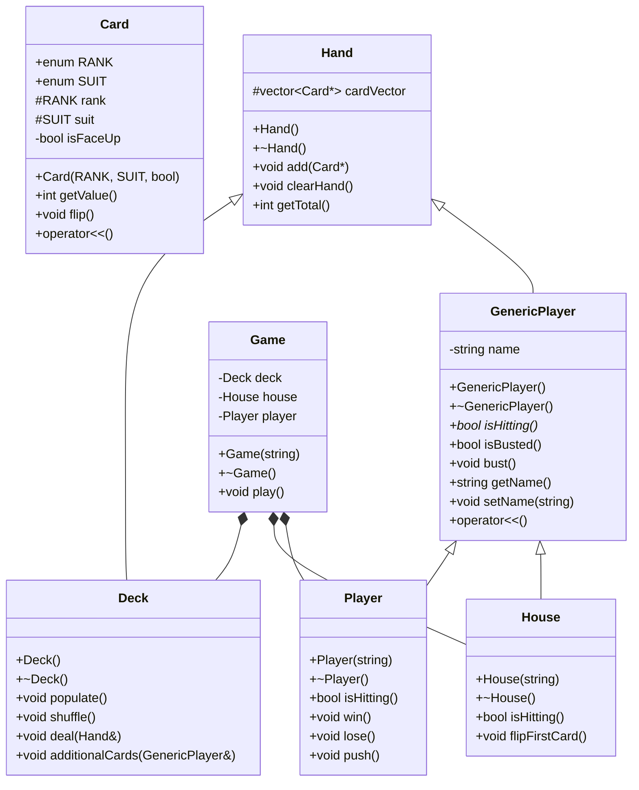

# ♠ Blackjack

A console-based, single-player Blackjack game built in C++ using object-oriented programming principles. The project models all core game entities as distinct classes connected through a multi-level inheritance hierarchy, closely following standard casino Blackjack rules.

---

## Table of Contents

- [Gameplay Overview](#gameplay-overview)
- [Project Structure](#project-structure)
- [Class Overview](#class-overview)
- [Class Diagram](#class-diagram)
- [Class Details](#class-details)
- [How to Build & Run](#how-to-build--run)
- [Example Output](#example-output)

---

## Gameplay Overview

- Cards 2–9 are worth their face value; 10, Jack, Queen, and King are each worth 10
- An Ace counts as 1 or 11, whichever produces the better hand
- The dealer reveals one card face-down at the start; it is flipped once the player stands
- A player wins by finishing closer to 21 than the dealer without going over
- The dealer (House) hits on any total ≤ 16 and stands on 17 or higher
- Outcomes: **Win**, **Lose**, or **Push** (tie)

---

## Project Structure

```
Blackjack-Project/
├── Card.h / Card.cpp           # Playing card with rank, suit, and face state
├── Hand.h / Hand.cpp           # Collection of Card pointers; calculates hand total
├── Deck.h / Deck.cpp           # Full 52-card deck; handles populate, shuffle, deal
├── GenericPlayer.h / .cpp      # Abstract base class for Player and House
├── Player.h / Player.cpp       # Human player; prompts for hit/stand input
├── House.h / House.cpp         # Dealer AI; hits on total ≤ 16
├── Game.h / Game.cpp           # Orchestrates a full round of Blackjack
└── main.cpp                    # Entry point; handles game loop and replay prompt
```

---

## Class Overview

| Class | Base Class | Description |
|---|---|---|
| `Card` | — | A single playing card with a rank, suit, and face-up/down state |
| `Hand` | — | A collection of `Card*` pointers; computes the hand's total value |
| `Deck` | `Hand` | A full 52-card deck with shuffle and deal functionality |
| `GenericPlayer` | `Hand` | Abstract base class shared by `Player` and `House` |
| `Player` | `GenericPlayer` | Human player; decides to hit or stand via console input |
| `House` | `GenericPlayer` | Dealer; automatically hits on totals ≤ 16 |
| `Game` | — | Manages the full game flow via composition of `Deck`, `Player`, and `House` |

---

## Class Diagram



> **Key:** `<|--` = Inheritance (is-a) &nbsp;|&nbsp; `*--` = Composition (has-a) &nbsp;|&nbsp; `*` = Pure virtual

---

## Class Details

### `Card`
Represents a single playing card. Stores a `RANK` and `SUIT` as scoped enumerators, and a `bool isFaceUp` to track visibility. `getValue()` returns 0 for face-down cards, and 10 for Jack, Queen, and King. The overloaded `operator<<` outputs shorthand notation (e.g., `5S` for 5 of Spades, `JH` for Jack of Hearts, `XX` for a face-down card).

### `Hand`
The base container class. Holds a `std::vector<Card*>` and provides `add()`, `clearHand()`, and `getTotal()`. The total calculation accounts for Aces, promoting them from 1 to 11 when the hand total is ≤ 11.

### `Deck`
Inherits from `Hand` and extends it with deck-specific functionality. `populate()` fills the vector with 52 heap-allocated `Card` objects by iterating over all rank and suit enumerators. `shuffle()` uses `std::random_shuffle`. `deal()` pops the back card in O(1) and adds it to any `Hand`. `additionalCards()` loops — dealing to any `GenericPlayer` — until they bust or choose to stand.

### `GenericPlayer` *(Abstract)*
Inherits from `Hand` and serves as the abstract base for both player types. Declares `isHitting()` as a pure virtual function, making this class non-instantiable. Provides shared behavior: `isBusted()` (total > 21), `bust()`, and name management. The overloaded `operator<<` prints the player's name, each card, and the current hand total.

### `Player`
Concrete subclass of `GenericPlayer` representing the human. `isHitting()` prompts the user by name and reads a `y`/`n` response. Also implements `win()`, `lose()`, and `push()` to display round outcomes.

### `House`
Concrete subclass of `GenericPlayer` representing the dealer. `isHitting()` returns `true` when `getTotal() <= 16`, implementing the standard dealer rule with no user input required. `flipFirstCard()` toggles the face state of the first card in `cardVector` to reveal or conceal the hole card.

### `Game`
Owns a `Deck`, `House`, and `Player` by composition. The constructor initializes the player's name, populates the deck, and shuffles it. `play()` deals two cards to each participant, manages the player and dealer turns through `Deck::additionalCards()`, determines the outcome, and clears both hands for the next round.

---

## How to Build & Run

**Requirements:** A C++ compiler supporting C++11 or later (e.g., g++, MSVC, clang++)

**Using g++:**
```bash
g++ -std=c++11 main.cpp Card.cpp Hand.cpp Deck.cpp GenericPlayer.cpp Player.cpp House.cpp Game.cpp -o blackjack
./blackjack
```

**Using Visual Studio:**  
Open `Blackjack Project.sln` and run with **Ctrl+F5**.

---

## Example Output

```
Enter your name: Alex

--- Initial Deal ---
Alex    5S JH (15)
House   XX 9C

--- Player's Turn ---
Alex, do you want to hit? (y/n): y
Alex    5S JH 7D (22)
Alex busts.

--- Player has busted! ---
Alex loses.

Do you want to play again? (y/n):
```
